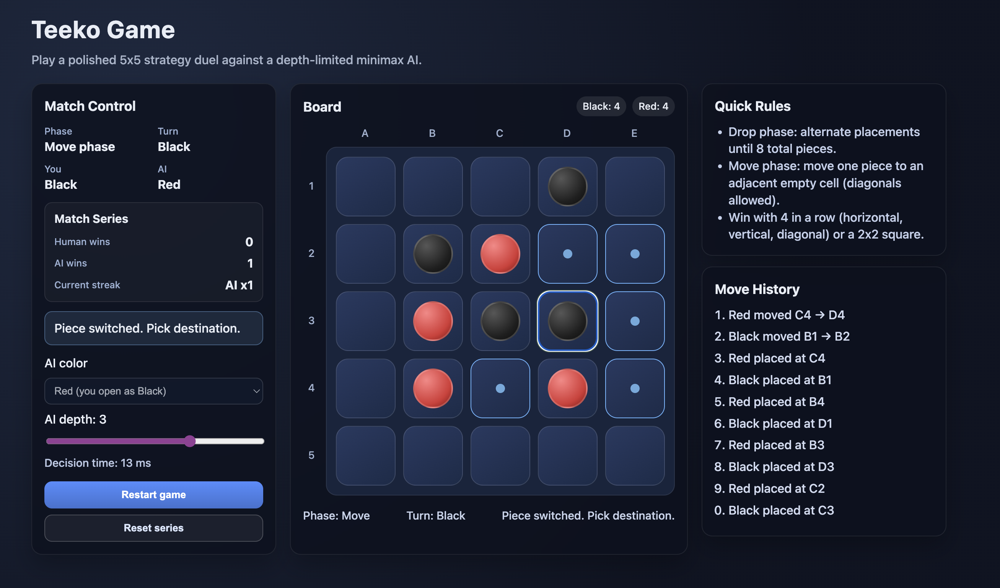

# Teeko Game

A portfolio-style interactive Teeko web app built with React + TypeScript + Vite.

## Features

- 5x5 interactive board UI
- Human vs AI gameplay
- Full Teeko rules:
  - drop phase and move phase
  - adjacency-based movement (including diagonals)
  - win checks for horizontal/vertical/diagonal 4-in-a-row + 2x2 box
- Minimax AI with configurable depth and alpha-beta pruning
- Heuristic scoring for non-terminal search nodes
- Move history, phase/turn indicators, and AI thinking state
- Restart and AI-color selection (AI can open as Black)



## Run locally

Install Node 18+ and run:

```bash
npm install
npm run dev
```

Open the local URL shown by Vite.

For production build:

```bash
npm run build
npm run preview
```

## Project structure

```text
.
  src/
    components/
      Cell.tsx
      TeekoBoard.tsx
      StatusPanel.tsx
      HistoryPanel.tsx
    game/
      types.ts       # core types
      constants.ts   # board size, piece labels, config defaults
      rules.ts       # board ops, legal moves, phase and winner checks
      heuristic.ts   # non-terminal evaluation
      minimax.ts     # depth-limited minimax + alpha-beta pruning
      engine.ts      # AI move entry point used by UI
    hooks/
      useTeekoGame.ts # game flow, interaction state, AI turn scheduling
    App.tsx
    styles.css
    main.tsx
```

## Architecture overview

- `src/game/*` is framework-agnostic logic so it can be moved to a backend service later.
- `src/hooks/useTeekoGame.ts` orchestrates gameplay and UI state without mixing rendering concerns.
- `src/components/*` keeps board rendering, status controls, and history modular and reusable.

## Extension ideas

- Swap minimax for iterative deepening + move ordering.
- Add a backend API endpoint for AI moves and keep frontend-only board state.
- Add persistent match stats and saved replays.
